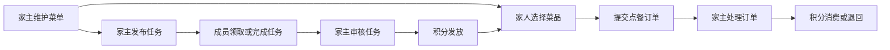
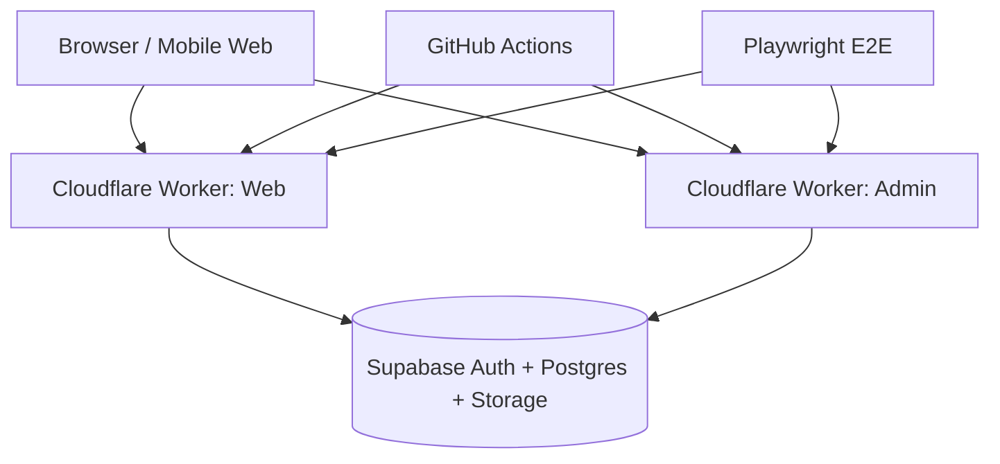

# Night Food 家宴星球

> 把点餐、任务和积分，变成一个家庭协作的小宇宙。

Night Food 是一个面向家庭场景的 Web 点餐与任务积分平台。它不是传统餐饮系统，也不是企业协作软件，而是把家庭里的日常点餐、家务任务、积分奖励、成员权限和规则管理串成一个轻量、清晰、有反馈的家庭协作闭环。

项目提供两个入口：

- **家庭端 Web**：家人用于点餐、查看订单、领取任务、提交任务和管理个人资料。
- **家主管理端 Admin**：家主用于维护菜单、处理订单、发布任务、调整积分、管理成员和配置家庭规则。

## 产品定位

Night Food 的核心定位是：

**一个给家庭使用的协作式点餐与积分任务平台。**

它解决的不是“如何卖餐”，而是“家庭成员如何更轻松地参与家庭运行”：

- 今天吃什么，不再靠群消息反复确认。
- 家务任务不再只是口头安排，而是有领取、提交、审核和奖励。
- 积分不再是抽象数字，而能用于家庭点餐和激励。
- 家主和家人权限边界清晰，家庭空间可通过邀请码加入。

## 一句话价值

Night Food 让家庭日常从“临时沟通”变成“有规则、有反馈、有参与感”的协作系统。

## 适用场景

- 家庭成员提前点餐，家主统一查看和处理订单。
- 家主发布任务，例如洗碗、扫地、整理房间、照顾宠物。
- 成员领取或完成任务后获得积分。
- 家主审核任务，手动调整积分。
- 家庭使用邀请码添加成员，并管理成员角色与访问状态。
- 菜单支持分类、菜品图片、积分价格、推荐菜和上下架。

## 用户角色

### 家主

家主是家庭空间的管理员，负责维护家庭运行规则。

家主可以：

- 创建家庭空间。
- 维护家庭邀请码。
- 创建和编辑菜单分类。
- 创建和编辑菜品。
- 设置菜品积分价格、图片、推荐状态和上下架状态。
- 查看和推进订单状态。
- 发布公开任务或指派任务给成员。
- 审核任务并发放积分。
- 手动调整成员积分。
- 管理家庭成员角色和状态。
- 配置家庭公告、用餐规则、任务规则等。

### 家庭成员

成员是家庭空间的参与者，主要面向日常使用。

成员可以：

- 注册并通过家庭邀请码加入家庭。
- 浏览菜单并下单。
- 查看自己的订单状态。
- 取消还未开始制作的订单。
- 查看可领取任务。
- 领取任务或处理家主指派任务。
- 提交任务完成结果。
- 查看个人积分和家庭状态。

## 核心闭环

Night Food 的体验不是由单点功能组成，而是由一个完整闭环驱动：

这个闭环的意义是：积分不只是展示数字，而是连接了任务激励和家庭点餐。

## 功能模块

### 1. 账号与家庭空间

- 支持账号密码注册登录。
- 家主可创建家庭。
- 家庭拥有唯一邀请码。
- 成员通过邀请码加入家庭。
- 家庭成员拥有不同角色与访问状态。

### 2. 菜单管理

家主管理端支持：

- 创建菜单分类。
- 编辑分类名称、排序和启用状态。
- 创建菜品。
- 编辑菜品名称、积分价格、排序、描述、图片。
- 设置菜品上下架。
- 设置今日推荐。
- 当前分类下静默筛选与编辑，避免页面频繁刷新。

家庭端支持：

- 按分类浏览菜品。
- 查看菜品图片、菜名和积分。
- 将菜品加入点餐列表。

### 3. 点餐与订单

成员可在家庭端提交订单。

订单支持：

- 提交订单。
- 查看历史订单。
- 按状态静默筛选订单。
- 在允许范围内取消订单。
- 家主管理端处理订单状态。
- 订单取消后积分自动退回。

订单状态包括：

- 待确认
- 已确认
- 制作中
- 已完成
- 已取消

### 4. 任务与积分

任务系统是 Night Food 的第二条核心线。

家主可以：

- 发布公开任务。
- 指派任务给指定成员。
- 设置任务奖励积分。
- 设置截止时间。
- 审核已提交任务。

成员可以：

- 查看可领取任务。
- 领取公开任务。
- 提交任务完成。
- 查看自己的任务状态。

任务状态包括：

- 开放中
- 已领取
- 进行中
- 已提交
- 已完成
- 已取消

### 5. 积分账户

积分是平台的家庭内部激励单位。

支持：

- 点餐消费积分。
- 取消订单退回积分。
- 完成任务获得积分。
- 家主手动加减积分。
- 查看成员积分。
- 记录积分流水。

### 6. 成员与权限管理

家庭成员管理支持：

- 查看家庭成员。
- 管理角色。
- 管理访问状态。
- 区分家主和普通成员能力边界。

权限设计原则：

- 家主负责规则、配置、菜单、订单、任务和积分。
- 成员负责参与点餐、领取任务和管理自己的内容。
- 后台管理端仅家主可进入。

### 7. 规则设置

家主可维护家庭运行规则，例如：

- 家庭公告。
- 用餐时间窗口。
- 任务审核规则。
- 点餐开放状态。

## 产品体验亮点

### Web / Admin 双端分离

家庭端面向成员日常使用，管理端面向家主配置和处理事务。两个端的职责清晰，不互相干扰。

### 移动端优先

家庭成员多数场景来自手机，因此页面采用移动端优先布局：

- 底部 Tab 导航。
- 卡片式信息展示。
- 大按钮和清晰触控区域。
- 暗色高对比主题。

### Orbit Family UI

项目使用一套偏发布会感和 Web3 气质的视觉语言：

- 深色宇宙背景。
- 暖橙高光。
- 玻璃卡片。
- 轨道式层级。
- 积分徽章感。
- 自定义下拉弹层。

### 静默筛选体验

菜单、订单、任务等页面已经从传统表单提交改为客户端静默筛选：

- 切换分类不再重新进入页面。
- 订单筛选不再提交整页刷新。
- 任务状态筛选在当前页面即时完成。
- URL 可静默同步，兼顾体验与可分享性。

### 云端部署

项目部署在云端：

- 前端和后台托管到 Cloudflare Workers。
- 数据库与认证使用 Supabase。
- GitHub Actions 自动部署。
- Playwright 线上 e2e 回归验证。

## 技术架构

### 前端技术

- Next.js App Router
- React Client Components
- TypeScript
- 自定义 CSS 主题
- Playwright e2e

### 云端与数据

- Cloudflare Workers
- OpenNext for Cloudflare
- Supabase Postgres
- Supabase Auth
- Supabase Storage

### 工程化

- Monorepo 项目结构。
- Web/Admin 双应用。
- GitHub Actions 自动部署。
- Cloudflare Secrets 管理环境变量。
- 线上 e2e 验证核心业务闭环。

## 数据模型概览

核心实体包括：

- `profiles`：用户资料。
- `households`：家庭空间。
- `household_members`：家庭成员与角色。
- `menu_categories`：菜单分类。
- `menu_items`：菜品。
- `orders`：订单。
- `order_items`：订单明细。
- `tasks`：家庭任务。
- `points_accounts`：积分账户。
- `points_transactions`：积分流水。
- `household_settings`：家庭规则设置。

## 当前完成度

项目当前已经具备完整可用的核心闭环：

- 账号注册登录。
- 家主创建家庭。
- 成员邀请码加入家庭。
- 家主管理菜单。
- 家人点餐。
- 家主处理订单。
- 成员领取和提交任务。
- 家主审核任务。
- 积分发放、扣减和退回。
- 成员、规则和权限管理。
- Web/Admin 云端部署。
- 线上 e2e 测试通过。

## 项目价值

Night Food 的价值不只是“做了一个点餐系统”。

它更像是一个家庭内部的小型协作网络：

- 把家庭任务变成有反馈的激励。
- 把点餐变成一种积分消费场景。
- 把家主的管理工作系统化。
- 把成员参与感变得更明确。
- 把家庭日常变成一个有规则的小宇宙。

## 未来路线图

### 短期

- 更完善的任务模板。
- 更细致的积分流水筛选。
- 菜品批量编辑。
- 家庭公告强化展示。
- PWA 安装体验。

### 中期

- 积分商城。
- 家庭排行榜。
- 家庭成就徽章。
- 消息通知。
- 点餐时间提醒。

### 长期

- AI 菜单推荐。
- AI 家务任务建议。
- 多家庭空间。
- 更多主题皮肤。
- 家庭年度报告。

## 结语

Night Food 希望让家庭协作不再沉重。

它把“吃什么”“谁来做”“怎么奖励”这些日常问题，变成一个轻量、有趣、可持续的小系统。家庭不是公司，但家庭也值得拥有更好的协作体验。

**Night Food 家宴星球：让每一次点餐和每一次任务，都成为家庭协作的一部分。**
